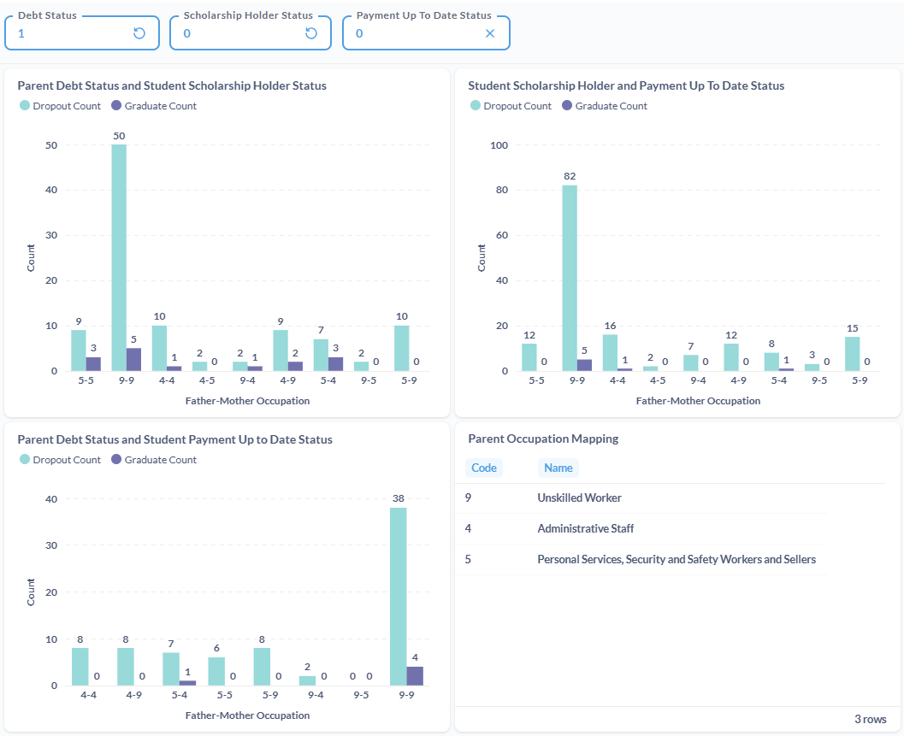

# Proyek Akhir: Menyelesaikan Permasalahan Jaya Jaya Institut

Email Dicoding : muhammadhafizhdzaki@gmail.com
Username Dicoding : haztsu
---

## Business Understanding
Jaya Jaya Institut merupakan salah satu institusi pendidikan yang telah berdiri sejak tahun 2000. Hingga saat ini ia telah mencetak banyak lulusan dengan reputasi yang sangat baik (Fiction Scenario).

### Permasalahan Bisnis
Dibalik tercetaknya banyak lulusan dengan reputasi yang sangat baik, Jaya Jaya Institut memiliki permasalahan terhadap mahasiswa yang tidak menyelesaikan pendidikan alias *dropout*. Tingginya tingkat *dropout* mahasiswa Jaya Jaya Institut menjadi permasalah besar untuk sebuah institusi pendidikan, terutama permasalahan reputasi dan akreditasi (Fiction Scenario). Oleh karena itu, Jaya Jaya Institut ingin mendeteksi secepat mungkin siswa yang memiliki peluang *dropout* agar bisa diberikan tindakan pencegahan.

### Cakupan Proyek
Melakukan analisis data dengan limitasi **dataset yang diberikan**. Hal yang dianalisis antara lain:
- Faktor yang menyebabkan siswa berpeluang melakukan dropout.
- Hubungan sebab akibat dari variabel bebas (faktor penyebab dropout siswa) dengan variabel terikat (status siswa).
- Alasan logis dan statistik yang menjadi penyebab kemungkinan dropoutnya siswa.
- Hal yang bisa dilakukan institusi **(company action-oriented)** untuk mengurangi siswa yang dropout.

### Persiapan

Sumber data: [here](https://archive.ics.uci.edu/dataset/697/predict+students+dropout+and+academic+success)

Setup environment:
```
$ conda create --name myenv "python<3.11"
$ conda activate myenv
$ pip install -r requirements.txt
```

## Business Dashboard

- Gambar Dashboard:
    1. haztsu-dashboard-page-1.jpg
    2. haztsu-dashboard-page-2.jpg
    3. haztsu-dashboard-page-3.jpg

- Metadata dashboard untuk Metabase:
    - ./metabase.db/metabase.mv.db
    
*Membaca dari kiri-kanan & atas-bawah*

1. Graduate - Dropout Ratio

    Rasio siswa di Jaya Jaya Institute yang lulus dan dropout. Terlihat jelas bahwa:

    - Rasio siswa **lulus** lebih kurang **61%**
    - Rasio siswa **dropout** lebih kurang **39%**

2. Average Student Grade in Every Semester

    Bar chart rata-rata nilai seluruh siswa (sem_grade) dari semester 1 dan semester 2. Terlihat jelas bahwa:

    - Siswa yang kemungkinan dropout, nilai semester 1 ke semester 2 **relatif turun** cukup besar
    - Siswa yang kemungkinan lulus, nilai semester 1 ke semester 2 **relatif sama** atau **naik**

3. Father Occupation vs Student Status

    Multiple bar chart yang memperlihatkan hubungan antara status siswa, baik lulus atau dropout dengan pekerjaan Ayah (Fathers_occupation). Terlihat jelas bahwa:

    - Ayah siswa yang perkerjaannya adalah *Unskilled Worker* memiliki **kemungkinan yang lebih tinggi** anaknya dropout

4. Mother Occupation vs Student Status

    Multiple bar chart yang memperlihatkan hubungan antara status siswa, baik lulus atau dropout dengan pekerjaan Ibu (Mothers_occupation).  Terlihat jelas bahwa:

    - Ibu siswa yang perkerjaannya adalah *Unskilled Worker* memiliki **kemungkinan yang lebih tinggi** anaknya dropout

5. Debt vs Scholarship Status

    Multiple bar chart yang memperlihatkan hubungan antara status siswa, baik lulus atau dropout dengan status mereka sebagai pemilik hutang dan pemegang beasiswa (Debtor dan Scholarship_holder). Terlihat jelas bahwa:

    -  Bagi siswa yang **memiliki hutang** dan **tidak memegang beasiswa**, rentan akan terkena **dropout**

6. Debt vs School Payment Status

    Multiple bar chart yang memperlihatkan hubungan antara status siswa, baik lulus atau dropout dengan status mereka sebagai pemilik hutang dan pembayaran biaya pendidikan (Debtor dan Tuition_fees_up_to_date). Terlihat jelas bahwa:

    - Baik **memiliki hutang maupun tidak**, jika **belum bayar biaya pendidikan**, maka akan **dropout**

7. Parent Occupation + Debt + Student Financial Analysis

    Terdapat tiga chart yang saling berhubungan yang akan menjelaskan hubungan chart ke-tiga s.d. chart ke-enam:
    
    - Parent Debt Status and Student Payment Up to Date Status
    - Parent Debt Status and Student Scholarship Holder Status
    - Student Scholarship Holder and Payment Up To Date Status

    Dengan fitur interaktif yang dimiliki Metabase, *variables* di dalam *where clause* bisa diubah sesuai keinginan user. Terdapat tiga *variables* yang menentukan hasil visualisasi data:

    1. Debt / Hutang ada?
    2. Payment / Sudah bayaran pendidikan? 
    3. Scholarship / Pemegang beasiswa?

    *0 : Tidak ada/belum/tidak | 1 : Ada/sudah/iya

    Contoh : Debt = 1 | Payment = 0 | Scholarhip = 0

    Maka akan terlihat tampilan chart seperti ini:

    

    - Parent Debt Status and Student Scholarship Holder Status

        * Orang tua siswa, baik Ayah dan Ibu adalah **Unskilled Worker**, dimana mereka **memiliki hutang**, dan anaknya **bukan pemegang beasiswa**, kemungkinan besar akan **dropout**

    - Student Scholarship Holder and Payment Up To Date Status

        * Orang tua siswa, baik Ayah dan Ibu adalah **Unskilled Worker**, dimana anak mereka **bukan pemegang beasiswa**, dan mereka **tidak bisa membayar pendidikan** anaknya, kemungkinan besar akan **dropout**

    - Parent Debt Status and Student Payment Up to Date Status

        * Orang tua siswa, baik Ayah dan Ibu adalah **Unskilled Worker**, dimana mereka **memiliki hutang**, dan sepertinya **tidak bisa membayar pendidikan** anaknya, kemungkinan besar akan **dropout**

## Menjalankan Sistem Machine Learning

Setelah melakukan setup environment, `Run semua cell pada file prediction.ipynb` atau bisa dilihat hasil deployment dari link yang bisa diakses melalui [link berikut](https://huggingface.co/spaces/hfzdzakii/StudentStatusPrediction)

## Conclusion

Projek ini berhasil menentukan faktor yang menyebabkan siswa di Jaya Jaya Institute dropout. 

Machine learning model lebih bisa menentukan seorang siswa akan dropout atau tidak menggunakan data dari fitur numerik, seperti :

1. Jumlah unit kurikuler smt 2 yang disetujui (Curricular_units_2nd_sem_approved)
2. Jumlah unit kurikuler smt 2 yang dievaluasi (Curricular_units_2nd_sem_evaluations)
3. Jumlah unit kurikuler smt 2 yang dikredikan (Curricular_units_2nd_sem_credited)
4. Jumlah unit kurikuler smt 2 yang terdaftar (Curricular_units_2nd_sem_enrolled)

Kita sebagai manusia, lebih bisa menentukan seorang siswa akan dropout atau tidak dari hasil visualisasi analsis data dari fitur kategorik, seperti:

1. Pekerjaan orang tua (Ayah dan Ibu)
2. Status memiliki hutang
3. Status pemegang beasiswa
4. Status pembayaran biaya pendidikan

### Rekomendasi Action Items

1. Bantuan akademik untuk siswa yang memiliki penurunan nilai dari semester 1 ke semester 2. Bantuan akademik ini bisa berupa, contoh pembuatan study group untuk memberikan tutor atau program mentorship

2. Berikan perhatian terhadap orang tua siswa yang keduanya adalah *Unskilled Worker*. Karena dari merekalah "penyumbang" terbesar siswa yang berkemungkinan akan dropout

3. Bantuan keringanan biaya pendidikan untuk siswa yang orang tuanya memiliki hutang dan bukan pemegang beasiswa. Bantuan keringanan ini bisa berupa pemberian beasiswa (baik penuh atau sebagian) atau bisa juga potongan biaya pendidikan bagi siswa yang kurang mampu namun berprestasi, baik akademik maupun non akademik

4. Monitoring siswa yang belum melakukan pembayaran dan sosialisasi pentingnya melakukan pembayaran pendidikan tepat waktu. Syukur pihak institut mengetahui alasan dibalik terlambatnya pembayaran siswa. Bila karena faktor ekonomi, bisa diberikan keringanan biaya. Bila <u>mungkin ada siswa yang tidak amanah</u>, bisa diberikan konseling

5. Terus pantau nilai akademik mahasiswa menggunakan Model Machine Learning yang telah dibuat